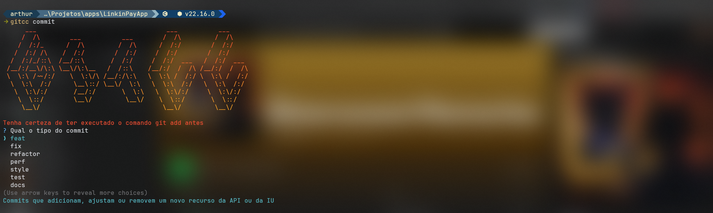

# Powershell Terminal


<div align="center">

</div>

## 1. Configure Windows Terminal

> [!NOTE]
> Install [JetBrainsMono Nerd Font](https://www.nerdfonts.com/font-downloads) before proceeding to the next step

Copy the json content below, and paste in into your terminal configuration file:

```json
{
    "$help": "https://aka.ms/terminal-documentation",
    "$schema": "https://aka.ms/terminal-profiles-schema",
    "actions": [],
    "copyFormatting": "none",
    "copyOnSelect": false,
    "defaultProfile": "{574e775e-4f2a-5b96-ac1e-a2962a402336}",
    "firstWindowPreference": "persistedWindowLayout",
    "keybindings": 
    [
        {
            "id": "Terminal.CopyToClipboard",
            "keys": "ctrl+c"
        },
        {
            "id": "Terminal.PasteFromClipboard",
            "keys": "ctrl+v"
        },
        {
            "id": "Terminal.DuplicatePaneAuto",
            "keys": "alt+shift+d"
        }
    ],
    "newTabMenu": 
    [
        {
            "type": "remainingProfiles"
        }
    ],
    "profiles": 
    {
        "defaults": 
        {
            "colorScheme": "One Half Dark",
            "cursorShape": "vintage",
            "experimental.retroTerminalEffect": false,
            "font": 
            {
                "face": "JetBrainsMono Nerd Font"
            },
            "opacity": 10,
            "useAcrylic": true
        },
        "list": 
        [
            {
                "commandline": "%SystemRoot%\\System32\\WindowsPowerShell\\v1.0\\powershell.exe",
                "guid": "{61c54bbd-c2c6-5271-96e7-009a87ff44bf}",
                "hidden": false,
                "name": "Windows PowerShell"
            },
            {
                "commandline": "%SystemRoot%\\System32\\cmd.exe",
                "guid": "{0caa0dad-35be-5f56-a8ff-afceeeaa6101}",
                "hidden": false,
                "name": "Command Prompt"
            },
            {
                "guid": "{b453ae62-4e3d-5e58-b989-0a998ec441b8}",
                "hidden": false,
                "name": "Azure Cloud Shell",
                "source": "Windows.Terminal.Azure"
            },
            {
                "guid": "{43ffdd3b-8f09-520e-b5c1-53123df09160}",
                "hidden": false,
                "name": "Developer Command Prompt for VS 2022",
                "source": "Windows.Terminal.VisualStudio"
            },
            {
                "guid": "{b1f9049c-7ee7-5f24-8d15-cd2e4d4a2d76}",
                "hidden": false,
                "name": "Developer PowerShell for VS 2022",
                "source": "Windows.Terminal.VisualStudio"
            },
            {
                "guid": "{16208362-94fc-5b1f-a491-5b2624d5ab56}",
                "hidden": true,
                "name": "Visual Studio Debug Console",
                "source": "VSDebugConsole"
            },
            {
                "guid": "{574e775e-4f2a-5b96-ac1e-a2962a402336}",
                "hidden": false,
                "name": "PowerShell",
                "source": "Windows.Terminal.PowershellCore"
            }
        ]
    },
    "schemes": 
    [
        {
            "background": "#001B26",
            "black": "#282C34",
            "blue": "#61AFEF",
            "brightBlack": "#5A6374",
            "brightBlue": "#61AFEF",
            "brightCyan": "#56B6C2",
            "brightGreen": "#98C379",
            "brightPurple": "#C678DD",
            "brightRed": "#E06C75",
            "brightWhite": "#DCDFE4",
            "brightYellow": "#E5C07B",
            "cursorColor": "#FFFFFF",
            "cyan": "#56B6C2",
            "foreground": "#DCDFE4",
            "green": "#98C379",
            "name": "One Half Dark (Copy)",
            "purple": "#C678DD",
            "red": "#E06C75",
            "selectionBackground": "#FFFFFF",
            "white": "#DCDFE4",
            "yellow": "#E5C07B"
        }
    ],
    "themes": [],
    "useAcrylicInTabRow": true
}
```

## 2. Install PowerShell

Go to **Microsoft Store**, search for **PowerShell** and install him 

After the download has concluded, reopen your terminal and set the **default profile to PowerShell**

Use the command `code $PROFILE` in your terminal and insert this command
```ps1
# Powershell
# Save the tab directory
function Invoke-Starship-PreCommand {
  $loc = $executionContext.SessionState.Path.CurrentLocation;
  $prompt = "$([char]27)]9;12$([char]7)"
  if ($loc.Provider.Name -eq "FileSystem")
  {
    $prompt += "$([char]27)]9;9;`"$($loc.ProviderPath)`"$([char]27)\"
  }
  $host.ui.Write($prompt)
}
# Autocomplete
Set-PSReadlineKeyHandler -Key Tab -Function MenuComplete

# Starship
Invoke-Expression (&starship init powershell)
$ENV:STARSHIP_CONFIG = "$HOME\.config\starship.toml"
$ENV:STARSHIP_CACHE = "$HOME\AppData\Local\Temp"

# Terminal Icons
Import-Module -Name Terminal-Icons
```

## 3. Terminal Icons

```shell
Install-Module -Name Terminal-Icons -Repository PSGallery
```


## 4. Instal Scoop

```shell
iwr -useb get.scoop.sh | iex
```

## 5. Install Starship

If you have another command-line, go see the **[guide of instalation](https://starship.rs/guide/)** to know the correct command

```shell
scoop install starship
```

### Configure

```shell
mkdir -p ~/.config && touch ~/.config/starship.toml
```

I'm using the **[Gruvbox Rainbow Preset](https://starship.rs/presets/gruvbox-rainbow)**, but with some changes

Inside of your starship.toml
```toml
"$schema" = 'https://starship.rs/config-schema.json'

format = """
[](color_orange)\
$username\
[](bg:color_yellow fg:color_orange)\
$directory\
[](fg:color_yellow bg:color_aqua)\
$git_branch\
$git_status\
[](fg:color_aqua bg:color_blue)\
$c\
$cpp\
$rust\
$golang\
$nodejs\
$php\
$java\
$kotlin\
$haskell\
$python\
[](fg:color_blue bg:color_docker)\
$docker_context\    
[](fg:color_docker)\
$line_break$character"""

palette = 'gruvbox_dark'

[palettes.gruvbox_dark]
color_fg0 = '#fbf1c7'
color_bg1 = '#3c3836'
color_bg3 = '#665c54'
color_blue = '#113F67'
color_aqua = '#94B4C1'
color_green = '#98971a'
color_orange = '#1B3C53'
color_purple = '#b16286'
color_red = '#cc241d'
color_yellow = '#456882'
color_docker = '#1D63ED'

[username]
show_always = true
style_user = "bg:color_orange fg:color_fg0"
style_root = "bg:color_orange fg:color_fg0"
format = '[ $user ]($style)'

[directory]
style = "fg:color_fg0 bg:color_yellow"
format = "[ $path ]($style)"
truncation_length = 3
truncation_symbol = "…/"

[directory.substitutions]
"Documents" = "󰈙 "
"Downloads" = " "
"Music" = "󰝚 "
"Pictures" = " "
"Developer" = "󰲋 "

[git_branch]
symbol = ""
style = "bg:color_aqua"
format = '[[ $symbol $branch ](fg:color_fg0 bg:color_aqua)]($style)'

[git_status]
style = "bg:color_aqua"
format = '[[($all_status$ahead_behind )](fg:color_fg0 bg:color_aqua)]($style)'

[nodejs]
symbol = ""
style = "bg:color_blue"
format = '[[ $symbol( $version) ](fg:color_fg0 bg:color_blue)]($style)'

[c]
symbol = " "
style = "bg:color_blue"
format = '[[ $symbol( $version) ](fg:color_fg0 bg:color_blue)]($style)'

[cpp]
symbol = " "
style = "bg:color_blue"
format = '[[ $symbol( $version) ](fg:color_fg0 bg:color_blue)]($style)'

[rust]
symbol = ""
style = "bg:color_blue"
format = '[[ $symbol( $version) ](fg:color_fg0 bg:color_blue)]($style)'

[golang]
symbol = ""
style = "bg:color_blue"
format = '[[ $symbol( $version) ](fg:color_fg0 bg:color_blue)]($style)'

[php]
symbol = ""
style = "bg:color_blue"
format = '[[ $symbol( $version) ](fg:color_fg0 bg:color_blue)]($style)'

[java]
symbol = ""
style = "bg:color_blue"
format = '[[ $symbol( $version) ](fg:color_fg0 bg:color_blue)]($style)'

[kotlin]
symbol = ""
style = "bg:color_blue"
format = '[[ $symbol( $version) ](fg:color_fg0 bg:color_blue)]($style)'

[haskell]
symbol = ""
style = "bg:color_blue"
format = '[[ $symbol( $version) ](fg:color_fg0 bg:color_blue)]($style)'

[python]
symbol = ""
style = "bg:color_blue"
format = '[[ $symbol( $version) ](fg:color_fg0 bg:color_blue)]($style)'

[docker_context]
symbol = ""
style = "bg:color_bg3"
format = '[[ $symbol( $context) ](fg:#FFFFFF bg:color_bg3)]($style)'

[line_break]
disabled = false

[character]
disabled = false
success_symbol = '[](bold fg:color_green)'
error_symbol = '[](bold fg:color_red)'
vimcmd_symbol = '[](bold fg:color_green)'
vimcmd_replace_one_symbol = '[](bold fg:color_purple)'
vimcmd_replace_symbol = '[](bold fg:color_purple)'
vimcmd_visual_symbol = '[](bold fg:color_yellow)'
```

## 6. Extra tools

### gitcc



For my git commits, i'm using my CLI tool **gitcc**, to make commits following the **[convencional commits](https://www.conventionalcommits.org/en/v1.0.0/)** pattern. If you want to install it, you just need have **[NodeJS](https://nodejs.org/pt)** on your machine

<a href="https://github.com/ArthurDeAraujoNeves3/gitcc" target="_blank"></a>
<a href="https://www.npmjs.com/package/@aarthur.neves/gitcc-cli" target="_blank"></a>
